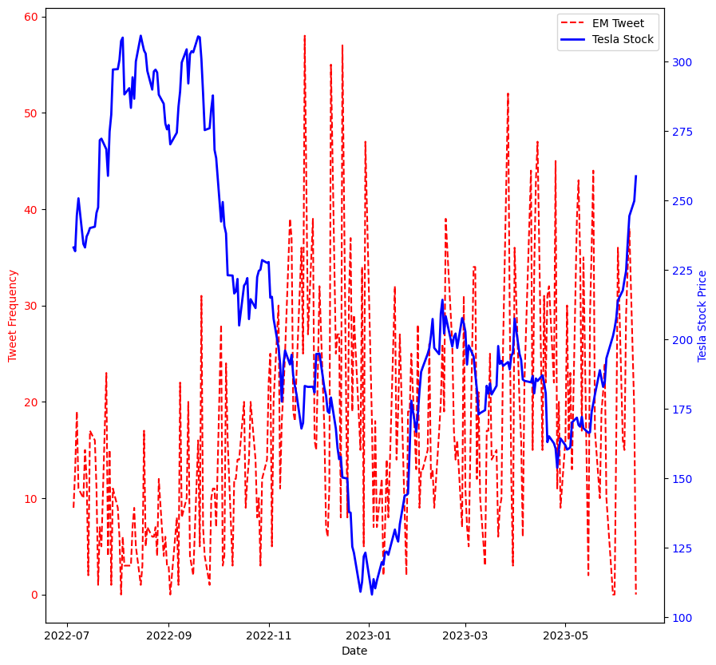
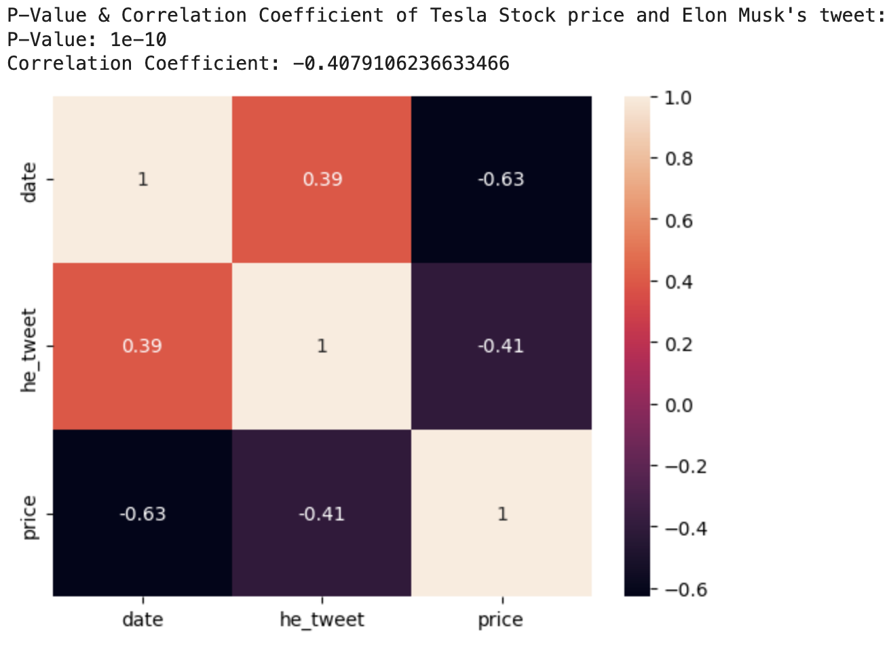
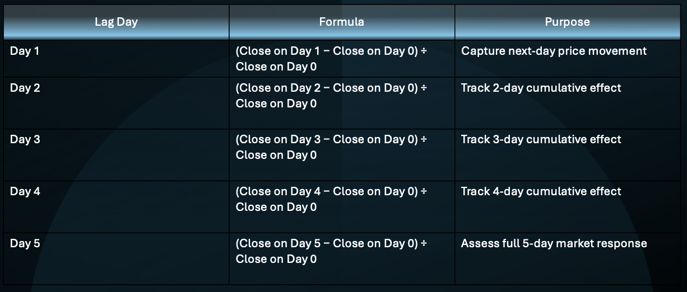
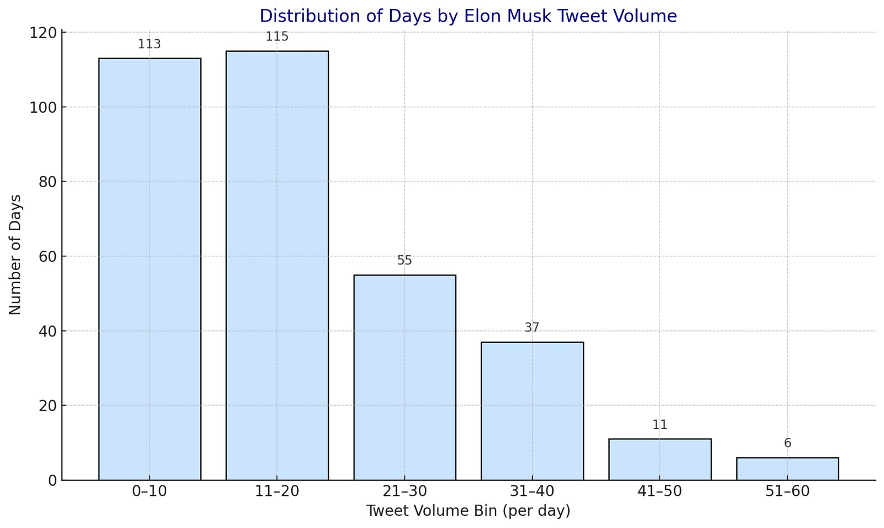
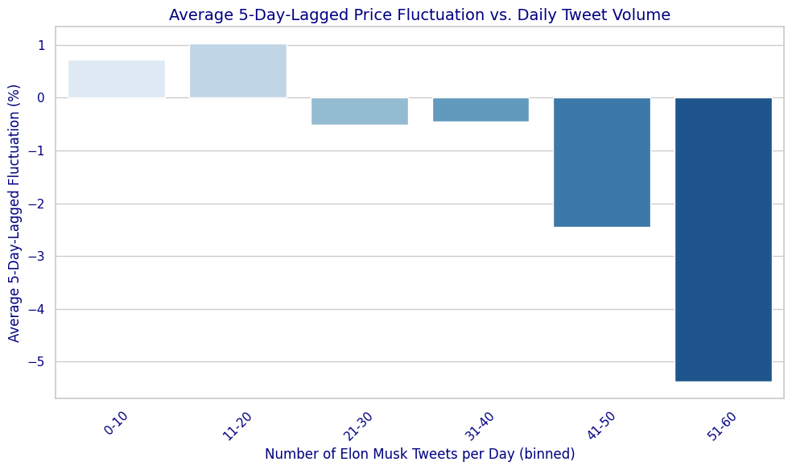
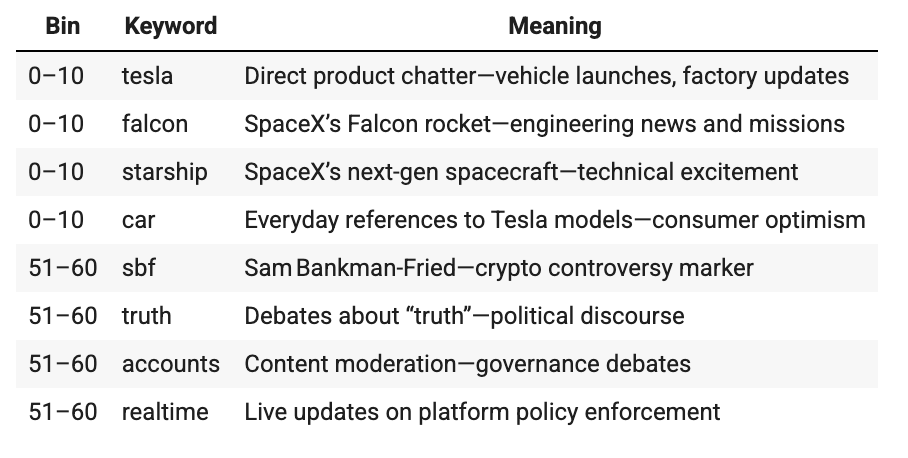
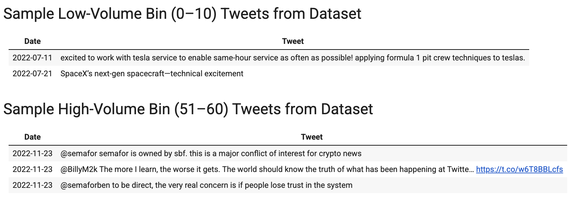
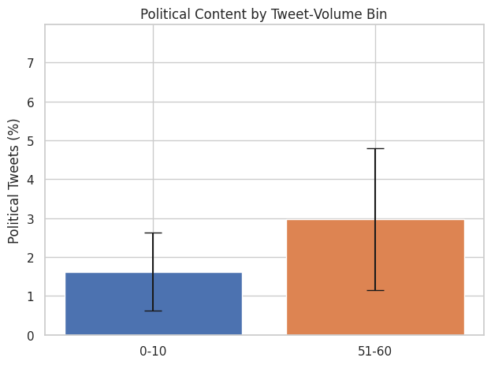

# Tweeting Tesla: Best Friends or Worst Enemies  
*By: Anish Prakash, Andiya Singh Bhandari, Tejdeep Iddum, Ajay Raigaga*  
*May 2025*

## The Loudest Brand Voice in Business

Tesla is one of the world’s most recognizable brands—and yet, it operates without a traditional marketing department. Instead, it relies on the voice of one man: Elon Musk.

With over 150 million followers and no filter, Musk’s Twitter feed is often louder than Tesla’s earnings reports. That raised a fundamental question for us:  
**Does Elon Musk’s tweeting behavior measurably influence Tesla’s stock price?**

To find out, we combined financial time series analysis with natural language processing (NLP) to study how often he tweets, what he tweets, and how the market reacts.

---

## Tweetstorms and Dips: Our First Signal

We began with a simple overlay of tweet frequency (red dashed line) and Tesla’s closing stock price (blue line).  
A visual pattern emerged: **tweet spikes often precede short-term price drops**.

This wasn’t definitive—but it was compelling enough to investigate with data.

---

## Testing the Impact: Can We Reject the Null?

To structure our analysis, we defined:

- **H₀:** Tweet volume has no effect on Tesla’s stock movement  
- **H₁:** Higher tweet volume increases same-day price fluctuation

We calculated **same-day fluctuation** as `(High – Low) / Previous Close` and paired it with Musk’s filtered tweet count (no retweets or replies).

---

## Confirming the Relationship

We found a **statistically significant positive correlation** between tweet volume and same-day price fluctuation.  
This means: **the more Musk tweets, the more volatile Tesla stock becomes that day**. It allowed us to confidently reject the null hypothesis.

---

## Looking Deeper: Building Lagged Reactions

We didn’t stop at same-day effects. To test if reactions linger, we calculated **lagged fluctuation** from Day 1 to Day 5 after each tweet.

Though Day 5 correlation was weaker visually, the structure helped us isolate patterns. This groundwork supported our pivot to **categorical analysis using tweet bins**.

---

## Binning the Noise

To reduce noise and improve interpretability, we grouped tweet volumes into 6 bins (0–10, 11–20 … up to 51–60 tweets/day).  
This gave us cleaner comparisons for later stages—especially content and tone analysis.

---

## Heavy Tweeting, Heavy Drops

This chart shows the **average 5-day lagged price fluctuation for each tweet bin**.  
The message is clear:  
- Days with low tweet volume saw **slight gains**  
- Days with 51–60 tweets resulted in an average **–5.39% stock drop**

This shift from positive to negative sets the stage for the deeper question:  
**Is it just the volume—or what he says that matters?**

---

## What Is He Saying? Let the Topics Speak

We used **Latent Dirichlet Allocation (LDA)** to uncover themes from low- and high-tweet bins.

- **Low-volume days (0–10)** featured technical updates and product chatter (e.g., *Tesla*, *Falcon*, *Starship*)
- **High-volume days (51–60)** turned ideological—mentioning *truth*, *accounts*, and *SBF* (Sam Bankman-Fried)

This dramatic shift in **topic** and **tone** hints at why the market responds so sharply.

---

## From Updates to Outrage

We pulled sample tweets from both ends of the spectrum:

- Low-volume days included SpaceX updates and customer service wins
- High-volume days were filled with polarizing debates, distrust, and crypto controversies

**It’s not just quantity—it’s provocation.**

---

## Politics in the Mix

Finally, we measured **political content** using keyword tagging.  
- On low-tweet days, 1.6% of tweets were political  
- On high-tweet days, that doubled to nearly 3%

This content escalation magnifies the emotional and market impact of tweetstorms.

---

## Wrapping It Up: This Is Signal, Not Noise

Our findings offer a compelling narrative:

- **More tweets → more same-day volatility**
- **Heavier tweeting → sharper 5-day price drops**
- **High-volume days → more ideological and political tone**

We don’t claim causality—but we do find consistent, meaningful relationships between Musk’s tweet behavior and market response.

---

## Our Advice? Better Beats Louder

Musk is Tesla’s most powerful communicator—but our analysis suggests that volume can become a liability.

If Tesla wants to inspire investor confidence, **fewer, sharper, and less polarizing tweets may be the smarter strategy**.

In short:  
**More isn’t better. Better is better.**

---

*See the full code and data on our GitHub repo: [anishp5/tesla-twitter-blog](https://github.com/anishp5/tesla-twitter-blog)*
